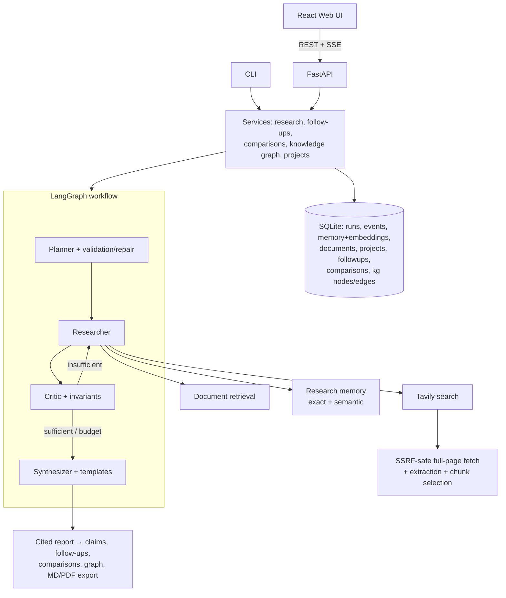

# Atlas

**Atlas** is a local-first, full-stack AI research platform. Ask it a complex question and a team of LLM agents plans the investigation, researches across the web (search + full-page extraction), your uploaded documents, and its own research memory, critiques its evidence, loops until coverage is sufficient, and delivers a cited report — streamed live to a web UI, organized into projects, traceable claim-by-claim, comparable across runs, explorable as a knowledge graph, and exportable as Markdown or PDF.

The LLM runs **locally via Ollama** (default: Qwen3 4B) — no paid LLM API. The only external service is Tavily web search (free tier). Accurately put: *local LLM inference with Tavily web search*.

> **Screenshots** — _coming soon: workspace, live run timeline, evidence inspector, knowledge graph, projects._

## Features (V3)

**Core engine (V1/V2)**
- Multi-agent LangGraph workflow — Planner → Researcher → Critic → (conditional research loop) → Synthesizer — with typed state, deterministic routing, iteration caps, semantic plan validation with one bounded repair, and critic-score invariants.
- Unified evidence model across web, documents (local RAG over PDF/TXT/MD), and research memory; deterministic URL dedup and evidence selection.
- Citation integrity enforced in code: numbered sources, invalid citations stripped, LLM reference sections removed, one-shot citation repair, deterministic `## Sources`, reasoning-artifact stripping.
- FAST/DEEP modes, human-in-the-loop plan approval/editing, SSE progress events, SQLite persistence/history, cancellation, metrics + deterministic evaluation.

**New in V3**
1. **Source-quality intelligence** — every web source gets a deterministic, explainable authority assessment (category, tier, 0–100 score, signals, warnings). It is explicitly *not* a truth score: it classifies the publisher (academic, government, standards body, news, community…), conservatively defaults unknown domains, and only breaks relevance ties during evidence selection. Quality is visible (and inspectable — the "why") throughout the UI and metrics.
2. **Full-page web research** — after search discovery, Atlas safely fetches top result pages, strips boilerplate, and selects query-relevant chunks deterministically, falling back to the snippet on any failure. The fetcher is hardened against SSRF (scheme allow-list, DNS resolution checks, private/loopback/link-local/metadata ranges blocked, every redirect hop re-validated, size/time/redirect limits, no JS execution).
3. **Follow-up research ("Ask Atlas")** — converse with a completed run. Analytical follow-ups answer from existing evidence; research follow-ups retrieve new web/document evidence. Parent sources keep their numbers; new sources append after them, so citations are never ambiguous. Fully persisted with SSE progress.
4. **Report templates** — Standard, Academic, Technical, Executive, Literature Review, Comparison, and size-capped Custom instructions (which can shape structure but can never alter citation/security rules). Reports can be **regenerated** from existing evidence with another template — no re-research — as a new run linked to its source.
5. **Claim-level evidence inspector** — click any inline `[n]` citation to open an inspector showing the source, its quality assessment, the evidence excerpts (with origin, extraction mode, retrieval timestamps, document page), and every claim that citation supports. Claim↔citation mapping is extracted mechanically from the report — never fabricated.
6. **Semantic research memory** — exact-match reuse stays the fast path; local embeddings add semantic reuse of evidence from similar past queries above a configurable threshold, with web-evidence TTL, project scoping, deduplication, preserved original provenance, and a per-run "use memory" switch.
7. **Projects / workspaces** — group runs, documents, comparisons, memory, and an aggregated knowledge graph. Deleting a project *detaches* its runs/documents (non-destructive) and clears only project-scoped memory cache.
8. **PDF export** — polished PDF generated from persisted report data (fpdf2, no browser): branding, metadata, report body with safe markdown rendering, verified sources, and a metrics summary. Markdown export remains.
9. **Research comparison** — compare 2–5 completed runs. Source overlap/uniqueness is computed deterministically from structured data; the narrative (agreements, contradictions, unique evidence) is written over the combined numbered sources and passes the same citation validation. Persisted, exportable, project-aware.
10. **Knowledge graph** — on-demand, evidence-grounded graph per run (aggregated per project). The LLM proposes entities/relations with supporting evidence numbers; Atlas validates every reference against real sources, discards anything unsupported, normalizes/dedupes entities, and enforces node/edge limits. Explorable in the UI (pan/zoom/filter/search, node and edge inspection with supporting sources).

## Architecture



### Source-quality methodology (and limits)

Deterministic rules over domain knowledge: curated publisher lists (academic, standards, research institutions, technical press, mainstream news, community platforms), TLD signals (.gov/.edu/.int — with caveats recorded as warnings), and URL signals (DOI boosts, blog/forum paths penalized, plain HTTP penalized). Unknown domains get a conservative neutral score plus an explicit warning rather than a judgment. **This measures publisher class, not claim truth** — the signals and warnings are stored so the UI can always show *why*.

## Tech Stack

**Backend:** Python 3.10 · LangGraph 1.x · LangChain 1.x · `langchain-ollama` (Qwen3, structured outputs) · `langchain-tavily` · FastAPI · SQLite (stdlib, versioned migrations, repository pattern) · NumPy (vector similarity) · pypdf · fpdf2 (PDF export) · Pydantic v2 · pytest
**Frontend:** React 18 · TypeScript · Vite · react-router · react-markdown · d3-force (graph layout) · vitest + Testing Library
**Local models:** `qwen3:4b` (default; `qwen3:8b` optional) and `nomic-embed-text` (embeddings), both via Ollama.

## Setup (Windows)

```powershell
# 1. Ollama + models (https://ollama.com/download)
ollama pull qwen3:4b
ollama pull nomic-embed-text

# 2. Backend
python -m venv .venv
.venv\Scripts\Activate.ps1
pip install -r requirements.txt
Copy-Item .env.example .env
notepad .env   # add TAVILY_API_KEY (free: https://app.tavily.com)

# 3. Frontend
cd frontend
npm install
```

## Running Atlas

```powershell
# API (repo root) — http://127.0.0.1:8000, docs at /docs
.venv\Scripts\python.exe -m src.api.server

# Web UI (second terminal) — http://localhost:5173
cd frontend; npm run dev

# CLI
.venv\Scripts\python.exe -m src.main --query "..." --mode fast
```

If port 8000 is taken: set `ATLAS_API_PORT`, and point the UI at it via `VITE_API_TARGET`.

## Environment Variables

All optional except `TAVILY_API_KEY`. V1/V2 settings unchanged (`ATLAS_MODEL`, `ATLAS_MAX_RESEARCH_ITERATIONS`, `ATLAS_SUFFICIENCY_THRESHOLD`, `ATLAS_MAX_EVIDENCE_FOR_*`, `ATLAS_MEMORY_TTL_HOURS`, `ATLAS_DATA_DIR`, `ATLAS_EMBEDDING_MODEL`, …— see `.env.example`). New in V3:

| Variable | Default | Purpose |
|---|---|---|
| `ATLAS_PAGE_FETCH_PER_QUERY` | `2` (FAST: 1) | Full pages fetched per query (0 disables) |
| `ATLAS_PAGE_TIMEOUT_SECONDS` / `ATLAS_PAGE_MAX_BYTES` | `15` / `1500000` | Per-page fetch limits |
| `ATLAS_PAGE_CHUNKS_PER_PAGE` | `2` | Relevant chunks kept per page |
| `ATLAS_MEMORY_SEMANTIC_THRESHOLD` | `0.83` | Cosine similarity needed for semantic memory reuse |
| `ATLAS_KG_MAX_NODES` / `ATLAS_KG_MAX_EDGES` | `40` / `60` | Knowledge-graph bounds |
| `ATLAS_PDF_FONT` | auto-detect | TTF for Unicode PDF export |
| `ATLAS_LLM_TIMEOUT_SECONDS` | `900` | Hard per-request LLM ceiling (stage timeouts never exceed it) |
| `ATLAS_LLM_NUM_CTX` | `8192` | Ollama context size, shared by all stages (changing it per request forces model reloads) |
| `ATLAS_LLM_KEEP_ALIVE` | `30m` | Keeps the model loaded between stages and runs |
| `ATLAS_RETRIEVAL_WORKERS` | `4` | Concurrent search / page-fetch workers |
| `ATLAS_DEEP_RUN_BUDGET_SECONDS` | `0` (none) | Optional whole-run budget for DEEP |
| `ATLAS_API_PORT` | `8000` | API port |

### FAST-mode performance budget

FAST runs the same graph under an explicit budget (`src/modes.py`), derived from measurements on a 4-core laptop CPU where qwen3:4b evaluates prompts at ~21–24 tok/s and generates at ~2.7–5 tok/s:

- **No hidden thinking** in any stage. With thinking on, Qwen spent ~11.5 min planning and ~19 min critiquing; the same calls without it took 77 s and 164 s.
- **Output caps and per-stage timeouts**: planner 450 tokens / 150 s, critic 320 / 150 s, synthesis 900 / 300 s, citation repair 180 s.
- **Bounded context**: at most 3 queries, 3 subquestions, 6 evidence items, 350 characters per evidence item for the critic, and a 4,200-character synthesis context.
- **Concurrent retrieval**: queries, and page fetches within a query, run in parallel. Results are merged in a fixed order, so the output stays deterministic.
- **9-minute run budget**: optional work (the critic pass, citation repair) is skipped rather than overrun. A critic timeout falls back to synthesis and is flagged. A synthesis timeout yields a labeled, fully cited evidence summary instead of discarding the research. Every fallback is recorded in metrics and shown in the UI.

DEEP keeps thinking on for structured stages and has no output caps.

Per-call diagnostics come from Ollama's own statistics: calls, prompt and output tokens, context size and time per stage. They appear under **Metrics → Model usage**.

## API (summary)

```
Health/meta     GET /api/health · GET /api/templates
Runs            POST/GET /api/runs · GET/DELETE /api/runs/{id} · POST .../cancel
                GET .../events (SSE) · GET .../metrics · GET .../claims
                POST .../plan/approve · POST .../plan/edit
                POST .../regenerate · GET .../export?format=markdown|pdf
Follow-ups      POST/GET /api/runs/{id}/followups · GET /api/followups/{id}
                POST /api/followups/{id}/cancel · GET /api/followups/{id}/events (SSE)
Comparisons     POST/GET /api/comparisons · GET/DELETE /api/comparisons/{id}
                GET .../claims · GET .../export · GET .../events (SSE)
Knowledge graph POST/GET /api/runs/{id}/knowledge-graph · GET .../events (SSE)
                GET /api/projects/{id}/knowledge-graph
Projects        POST/GET /api/projects · GET/PATCH/DELETE /api/projects/{id}
                PUT/DELETE /api/projects/{id}/documents/{docId}
Documents       POST/GET /api/documents (project_id aware) · GET/DELETE /api/documents/{id}
```

## Database & migrations

One SQLite file (`data/atlas.db`, WAL) with versioned, non-destructive migrations. V3 (migration v2) adds `projects`, `followups`, `comparisons`, `kg_nodes`/`kg_edges`/`kg_status`, `project_id`/`template` columns on runs and documents, and rebuilds `memory` in place (preserving rows) to add project scope + query embeddings. Pre-V3 databases upgrade automatically; old runs stay readable (covered by migration tests).

## Testing

```powershell
.venv\Scripts\python.exe -m pytest -q          # backend: fully offline
cd frontend
npm run typecheck; npm test -- --run; npm run build
```

The backend suite (330 tests) covers each V3 feature individually — quality scoring/determinism, SSRF/redirect attacks and extraction, follow-up kinds/numbering/persistence, every template + regeneration, claim mapping, semantic memory thresholds/TTL/scoping, project CRUD/isolation/deletion semantics, PDF validity/safety, comparison dedup/citations, knowledge-graph provenance validation — plus a full cross-feature pipeline test and database-migration tests, alongside all V1/V2 regression suites. No test touches the network, Tavily, or a live Ollama.

## Security

Web pages, documents, and memory are **data, never instructions** (prompt-injection framing preserved everywhere, including page extraction and KG prompts). SSRF protections as above. Custom templates cannot override citation/security rules. Evidence renders as text in the UI (no raw HTML paths) and as text in PDFs. Uploads keep sanitized names, size/type limits, and checksums. API errors never expose tracebacks or secrets.

## Limitations

- Local CPU inference is slow; follow-ups/comparisons/KG each cost one LLM call, and DEEP runs remain many minutes on modest hardware.
- Source quality is a publisher-class heuristic from curated lists — unknown-but-excellent niche publishers score neutral; it never evaluates claim truth.
- Full-page extraction is HTML-text only (no JS rendering, no OCR); paywalled/dynamic pages fall back to snippets.
- Knowledge-graph extraction runs with Qwen thinking disabled (thinking + nested JSON schemas is pathologically slow on CPU — observed >30 min vs ~2 min without); richness is bounded by the local model and unsupported proposals are dropped rather than repaired.
- Comparison narrative quality depends on the local model; the deterministic overlap/source sections are exact.
- Single-process, single-user deployment (worker threads, in-process bus).
- Follow-up threads are linear (no branching conversations).

## Roadmap

OCR for scanned PDFs · branching follow-up threads · cross-encoder reranking for memory/RAG · LangGraph checkpointing for mid-run restarts · multi-user deployment (Postgres + job queue) · tracing (LangSmith/OpenTelemetry) · systematic agent evaluation · Docker.

## License

MIT. Atlas depends on third-party open-source packages (LangGraph, LangChain, FastAPI, React, fpdf2, etc.) under their own licenses.
