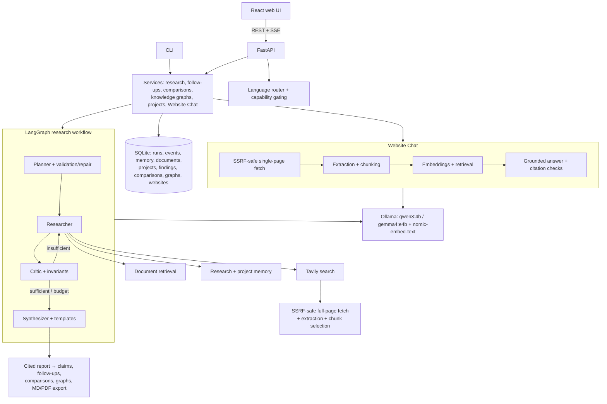

# Atlas

**Multi-agent research, grounded in your sources.**

Atlas is a local-first, full-stack AI research platform. Ask it a complex question and a team of LLM agents plans the investigation, gathers evidence from the web, your uploaded documents and its own research memory, critiques that evidence, loops until coverage is sufficient, and writes a report in which every claim carries a clickable citation back to its source. Alongside research, **Website Chat** lets you index a single webpage and ask questions that are answered only from that page, with each answer linked to the exact passage it came from.

Atlas exists to make AI research *checkable*. Language models are fluent but unaccountable; Atlas puts the evidence first: sources are collected and numbered before anything is written, citations are validated in code rather than trusted, and the model runs **locally via Ollama**, so your documents and questions stay on your machine. The only external service is Tavily web search (free tier). Accurately put: *local LLM inference with Tavily web search*.

## Highlights

**Research**
- **Multi-agent workflow** (LangGraph): Planner → Researcher → Critic → (conditional research loop) → Synthesizer, with typed state, deterministic routing, iteration caps, plan validation with one bounded repair, and human-in-the-loop plan approval/editing.
- **FAST and DEEP modes**: FAST runs under an explicit, measured time budget for CPU-local models; DEEP keeps model thinking on for the structured stages and has no output caps.
- **Three source scopes**: *Web*, *Documents* (local RAG over uploaded PDF/TXT/MD), or *Web + Documents*, unified into one evidence model.
- **Full-page web research**: search discovery plus SSRF-safe page fetching, boilerplate stripping and query-relevant chunk selection.
- **Source quality**: a deterministic, explainable publisher assessment for every web source (category, tier, score, signals, warnings). It is explicitly *not* a truth score.
- **Report templates**: Standard, Academic, Technical, Executive, Literature Review, Comparison, and size-capped Custom; reports can be regenerated from existing evidence without re-researching.

**Evidence you can check**
- **Citation integrity enforced in code**: numbered sources, invalid citations stripped, model-written reference lists removed, one-shot citation repair, and a deterministic `## Sources` section.
- **Clickable citations and claim-level evidence inspector**: every inline `[n]` opens the source, its quality assessment, the evidence excerpts with provenance (origin, extraction mode, retrieval time, document page), and every claim that citation supports.
- **Follow-up questions**: converse with a completed run; analytical follow-ups answer from existing evidence, research follow-ups gather new evidence while keeping existing citation numbers stable.

**Organising knowledge**
- **Projects**: group runs, documents, comparisons and memory into workspaces with an overview page.
- **Persistent project findings**: cited findings are extracted deterministically from completed runs and fed to later research in the same project, so a project builds on what it already established.
- **Deterministic project Knowledge Graph**: derived from stored findings with no LLM call. Concepts and their co-occurrence are honestly labelled `RELATED_TO`, never presented as causal. A separate per-run graph has the model propose entities and relations, and Atlas validates each one against real sources.
- **Run comparison**: compare 2 to 5 completed runs. Source overlap is computed exactly; the narrative is validated against the combined numbered sources.
- **Research memory**: exact and semantic reuse of past web evidence, with TTL, project scoping and preserved provenance.
- **Export**: Markdown and PDF (fpdf2, with HarfBuzz shaping for Devanagari and Malayalam).

**Website Chat** and **multilingual support** are described in their own sections below.

## Website Chat

Index one public webpage, then chat with it. Every answer comes only from that page and cites the exact passages it used.

```
URL
 → safe fetch (one page, bounded)
 → content extraction (structure-preserving, boilerplate removed)
 → section-aware chunking
 → embeddings (nomic-embed-text, the same model as document RAG)
 → retrieval (cosine + lexical signals, scoped to that one page)
 → grounded answer from the local LLM
 → [n] citations that open the exact stored passage
```

- **Grounded by construction.** Answers without citations, or containing figures that appear in none of the retrieved passages, are rejected. If the page does not contain the answer, Atlas says so instead of guessing.
- **Exact evidence.** A citation opens the stored passage in its original language, never a translation or a paraphrase. Citations are frozen snapshots, so they keep working after the page is re-indexed.
- **Responsive answering.** Your question appears immediately; a live card shows the real backend stage (searching, generating, checking citations) and the elapsed time, with a Cancel button. Answers have a hard 6-minute deadline that includes any retry, and a cancelled or failed answer never leaves partial text behind.
- **Lifecycle.** Re-index with change detection (unchanged content reuses the index; changed content is swapped atomically), duplicate-URL reuse, cancellation, delete with cascade, and recovery after a restart. No LLM call is made during ingestion.

**Security properties**
- `http`/`https` only; credentials in URLs rejected.
- SSRF protection: every resolved address must be public (loopback, private, link-local and cloud-metadata ranges are blocked, including IPv6-wrapped forms), and the connection is pinned to the validated address so DNS cannot change between check and connect.
- Redirects are followed manually and every hop is re-validated.
- Bounded fetches: connect/read/total timeouts, a decoded-size cap, a content-type allowlist. PDFs are directed to Documents.
- Webpage text is **untrusted evidence, never instructions**: it is fenced in delimiters the page cannot forge, prompt-injection attempts are reported as page content rather than obeyed, and answers cannot contain links or images.
- Pages behind logins, paywalls, CAPTCHAs or bot protection are not bypassed.

Website Chat V1 is intentionally **one webpage at a time**. It is not a whole-domain crawler.

## Languages

The interface is fully translated into six languages: **English, Spanish, Hindi, German, French and Malayalam**. Generated output (reports, follow-ups, website answers) is a different matter: it depends on what the configured local model can produce reliably, so Atlas gates each language and feature on a recorded, validated capability instead of assuming every language works.

| Language | UI | Generated output with the default local models |
|---|---|---|
| English | ✔ | Full support (`qwen3:4b`); comparison narratives are validation-gated |
| Spanish | ✔ | Research reports, regeneration, follow-ups and Website Chat (`qwen3:4b`) |
| Hindi | ✔ | Limited: generated locally by `gemma4:e4b`, slower than English |
| German | ✔ | Limited: generated locally by `gemma4:e4b`, slower than English |
| French | ✔ | Not available with the current local models (UI only) |
| Malayalam | ✔ | Not available with the current local models (UI only) |

- Comparison narratives are validation-gated and are not offered in Spanish, Hindi or German.
- Project memory and the project Knowledge Graph work in English by design.
- When a requested language cannot be generated, Atlas says so up front and asks you to choose English explicitly; it never silently switches languages.
- Evidence always stays in its original language.
- Language routing is configurable (`ATLAS_LANGUAGE_MODELS`), and which models you have pulled in Ollama determines which languages are available.

## Architecture



### Source-quality methodology (and limits)

Deterministic rules over domain knowledge: curated publisher lists (academic, standards, research institutions, technical press, mainstream news, community platforms), TLD signals (.gov/.edu/.int, with caveats recorded as warnings), and URL signals (DOI boosts, blog/forum paths penalised, plain HTTP penalised). Unknown domains get a conservative neutral score plus an explicit warning rather than a judgment. **This measures publisher class, not claim truth.** The signals and warnings are stored so the UI can always show *why*.

## Tech Stack

**Backend:** Python 3.10 · LangGraph 1.x · LangChain 1.x · `langchain-ollama` · `langchain-tavily` · FastAPI + Uvicorn · SQLite (stdlib, versioned migrations, repository pattern) · Pydantic v2 · httpx · NumPy (vector similarity) · pypdf · fpdf2 + uharfbuzz (PDF export) · pytest

**Frontend:** React 18 · TypeScript · Vite · react-router · react-markdown · d3-force (graph layout) · Vitest + Testing Library

**Local models (via Ollama):** `qwen3:4b` (default generation model) · `gemma4:e4b` (Hindi and German) · `nomic-embed-text` (embeddings for documents, memory and Website Chat)

## Getting Started

### Prerequisites

- Python 3.10+
- Node.js 18+ and npm
- [Ollama](https://ollama.com/download)
- A free [Tavily](https://app.tavily.com) API key (web research only)

### 1. Models

```powershell
ollama pull qwen3:4b
ollama pull nomic-embed-text
ollama pull gemma4:e4b    # optional: Hindi and German output
```

Atlas only offers output languages whose routed model is available. Without `gemma4:e4b`, Hindi and German stay UI-only.

### 2. Backend

```powershell
python -m venv .venv
.venv\Scripts\Activate.ps1
pip install -r requirements.txt
Copy-Item .env.example .env
notepad .env   # set TAVILY_API_KEY; everything else has working defaults
```

On macOS/Linux, use `source .venv/bin/activate` and `cp .env.example .env`.

### 3. Frontend

```powershell
cd frontend
npm install
```

### Running Atlas

```powershell
# API (repo root): http://127.0.0.1:8000, interactive docs at /docs
.venv\Scripts\python.exe -m src.api.server

# Web UI (second terminal): http://localhost:5173
cd frontend; npm run dev

# CLI
.venv\Scripts\python.exe -m src.main --query "..." --mode fast
```

If port 8000 is taken, set `ATLAS_API_PORT` for the API and point the UI at it with `VITE_API_TARGET` (for example `http://127.0.0.1:8010`).

## Configuration

All settings are optional except `TAVILY_API_KEY`; see `.env.example` for the full list. Notable settings:

| Variable | Default | Purpose |
|---|---|---|
| `ATLAS_MODEL` | `qwen3:4b` | Default generation model |
| `ATLAS_LANGUAGE_MODELS` | `hi=gemma4:e4b,de=gemma4:e4b` built in | Per-language model routing, e.g. `ml=qwen3:8b` |
| `ATLAS_EMBEDDING_MODEL` | `nomic-embed-text` | Embeddings for documents, memory and Website Chat |
| `ATLAS_DATA_DIR` | `data` | SQLite database and uploads |
| `ATLAS_PAGE_FETCH_PER_QUERY` | `2` (FAST: 1) | Full pages fetched per research query (0 disables) |
| `ATLAS_MEMORY_SEMANTIC_THRESHOLD` | `0.83` | Similarity needed for semantic evidence reuse |
| `ATLAS_PROJECT_MEMORY_THRESHOLD` | `0.65` | Similarity needed to reuse a project finding |
| `ATLAS_KG_MAX_NODES` / `ATLAS_KG_MAX_EDGES` | `40` / `60` | Knowledge-graph bounds |
| `ATLAS_WEBSITE_MAX_BYTES` / `ATLAS_WEBSITE_MAX_CHUNKS` | `3000000` / `300` | Website Chat page size and index limits |
| `ATLAS_WEBSITE_CHAT_TIMEOUT_SECONDS` | `360` | Whole-answer deadline (can only be lowered) |
| `ATLAS_LLM_TIMEOUT_SECONDS` | `900` | Hard per-request LLM ceiling |
| `ATLAS_LLM_NUM_CTX` / `ATLAS_LLM_KEEP_ALIVE` | `8192` / `30m` | Ollama context size (shared by all stages) and keep-alive |
| `ATLAS_RETRIEVAL_WORKERS` | `4` | Concurrent search / page-fetch workers |
| `ATLAS_DEEP_RUN_BUDGET_SECONDS` | `0` (none) | Optional whole-run budget for DEEP |
| `ATLAS_PDF_FONT` | auto-detect | TTF for Unicode PDF export |
| `ATLAS_API_PORT` | `8000` | API port |

### FAST-mode performance budget

FAST runs the same graph under an explicit budget (`src/modes.py`), derived from measurements on a 4-core laptop CPU where qwen3:4b evaluates prompts at ~21–24 tok/s and generates at ~2.7–5 tok/s:

- **No hidden thinking** in any stage. With thinking on, Qwen spent ~11.5 min planning and ~19 min critiquing; the same calls without it took 77 s and 164 s.
- **Output caps and per-stage timeouts**: planner 450 tokens / 150 s, critic 320 / 150 s, synthesis 900 / 300 s, citation repair 180 s.
- **Bounded context**: at most 3 queries, 3 subquestions, 6 evidence items, 350 characters per evidence item for the critic, and a 4,200-character synthesis context.
- **Concurrent retrieval**: queries, and page fetches within a query, run in parallel. Results are merged in a fixed order, so the output stays deterministic.
- **9-minute run budget**: optional work (the critic pass, citation repair) is skipped rather than overrun. A critic timeout falls back to synthesis and is flagged. A synthesis timeout yields a labelled, fully cited evidence summary instead of discarding the research. Every fallback is recorded in metrics and shown in the UI.

DEEP keeps thinking on for structured stages and has no output caps. Website Chat sizes its context to the question: focused questions use a few strong passages and a short answer budget, broad questions up to six passages.

Per-call diagnostics come from Ollama's own statistics (calls, prompt and output tokens, context size, time per stage) and appear under **Metrics → Model usage**.

## API (summary)

Interactive OpenAPI docs are served at `/docs`.

```
Health/meta      GET /api/health · GET /api/templates · GET /api/capabilities/languages
Runs             POST/GET /api/runs · GET/DELETE /api/runs/{id} · POST .../cancel
                 GET .../events (SSE) · GET .../metrics · GET .../claims
                 POST .../plan/approve · POST .../plan/edit
                 POST .../regenerate · GET .../export?format=markdown|pdf
Follow-ups       POST/GET /api/runs/{id}/followups · GET /api/followups/{id}
                 POST /api/followups/{id}/cancel · GET /api/followups/{id}/events (SSE)
Comparisons      POST/GET /api/comparisons · GET/DELETE /api/comparisons/{id}
                 POST .../cancel · GET .../claims · GET .../export · GET .../events (SSE)
Knowledge graph  POST/GET /api/runs/{id}/knowledge-graph · GET .../events (SSE)
                 GET /api/projects/{id}/knowledge-graph
Projects         POST/GET /api/projects · GET/PATCH/DELETE /api/projects/{id}
                 GET /api/projects/{id}/overview
                 PUT/DELETE /api/projects/{id}/documents/{docId}
Documents        POST/GET /api/documents · GET/DELETE /api/documents/{id}
Website Chat     POST/GET /api/websites · GET/DELETE /api/websites/{id}
                 POST /api/websites/{id}/refresh · POST /api/websites/{id}/cancel
                 GET/POST /api/websites/{id}/conversations
                 GET/DELETE /api/website-conversations/{id}
                 POST /api/website-conversations/{id}/messages
                 POST /api/website-messages/{id}/cancel
```

## Database & migrations

One SQLite file (`data/atlas.db`, WAL) with versioned, non-destructive migrations (currently v5). Each migration only adds: v2 projects, follow-ups, comparisons and knowledge graphs; v3 project findings; v4 the output language of each run; v5 the Website Chat tables (websites, chunks, conversations, messages). Older databases upgrade automatically on startup, and existing runs stay readable (covered by migration tests).

## Testing

```powershell
.venv\Scripts\python.exe -m pytest -q          # backend: fully offline
cd frontend
npm run typecheck; npm test -- --run; npm run build
```

Current state: **939 backend tests and 247 frontend tests pass**, the TypeScript typecheck is clean, and the production build succeeds. The backend suite runs fully offline (no network, Tavily or live Ollama) and covers each subsystem individually: workflow routing and plan validation, citation integrity, SSRF and redirect attacks, extraction and chunking, memory and project findings, graph provenance, comparison validation, multilingual capability gating and Unicode handling, migrations, Website Chat ingestion, retrieval, grounding, deadlines, cancellation and prompt-injection resistance. The tests run locally; there is no CI pipeline yet.

Beyond the automated suites, the major workflows have been tested by hand in a real browser against live local models: research, documents, projects, comparisons, multilingual output and Website Chat, at desktop and mobile widths in light and dark themes.

## Security

Web pages, documents, website text and memory are **data, never instructions**: prompt-injection framing is applied everywhere, including page extraction, knowledge-graph prompts and Website Chat. SSRF protections cover both research page fetching and Website Chat. Custom templates cannot override citation or security rules. Evidence renders as text in the UI (no raw HTML paths) and as text in PDFs. Uploads keep sanitised names, size/type limits and checksums. API errors never expose tracebacks or secrets; Website Chat errors carry stable, translatable codes.

## Project Status & Limitations

Atlas is an active, local-first research project. Its current boundaries are deliberate:

- **CPU-local generation takes time.** Research runs take minutes on modest hardware, and Website Chat answers typically take one to three minutes on CPU. Every stage is bounded by measured budgets, and long work can be cancelled.
- **Multilingual generation depends on the model.** Six UI languages are complete; generated output is offered only where the routed local model has been validated (see [Languages](#languages)).
- **Project memory and the project Knowledge Graph are English-only.** They are built from deterministic text analysis tuned for English.
- **Comparisons are validation-gated.** A comparison narrative is shown only if it passes Atlas's attribution checks; its overlap and source sections are always exact.
- **Website Chat V1 indexes one webpage**, not a domain. Pages that need JavaScript to render, or sit behind logins, paywalls or CAPTCHAs, are reported as not indexable rather than bypassed.
- **Source quality is a publisher-class heuristic**, not a truth judgment. Excellent niche publishers score neutral.
- **Full-page extraction is HTML text only**: no JavaScript rendering and no OCR for scanned PDFs.
- **Single-process, single-user deployment** (worker threads, in-process event bus).

## Roadmap

OCR for scanned PDFs · branching follow-up threads · multi-page Website Chat sources · cross-encoder reranking for memory/RAG · LangGraph checkpointing for mid-run restarts · multi-user deployment (Postgres + job queue) · tracing (LangSmith/OpenTelemetry) · continuous integration · Docker.

## License

Atlas is released under the [MIT License](LICENSE). It depends on third-party open-source packages (LangGraph, LangChain, FastAPI, React, fpdf2 and others) under their own licenses. The bundled fonts are distributed under the SIL Open Font License 1.1; see [`frontend/public/fonts/`](frontend/public/fonts) and [`src/export/fonts/`](src/export/fonts).
